# Wiki 概览

> 此页面是 wiki 的鸟瞰视图，反映当前知识体系的整体图景。
> 每次重大 ingest 后更新。

## 当前焦点

- **个人知识管理（PKM）**：本 wiki 的初始主题，已覆盖 Bush→Luhmann→Forte→Karpathy 思想谱系
- **AI 工具与协议**：覆盖 MCP、Context 工程、AI Agent、Vibe Coding、Agent 工具设计、Harness 架构等核心技术
- **交叉发现**：PKM 方法论与 AI 系统设计存在深层共鸣——[[llm-wiki-pattern|LLM Wiki]] 本身就是两个主题的交汇点。更深一层：本 Wiki 本身就是一个 [[harness|Harness]] 实例（详见 [[wiki-as-harness]]）

## 已形成的核心认知

1. **维护是知识库死亡的原因**：人类放弃知识库不是因为阅读或思考困难，而是因为记账负担增长快于价值。LLM 的维护成本接近零，从根本上改变了这个等式
2. **编译 > 检索**：预先将知识编译到持久结构中，比每次查询时从原始文档重新检索（RAG）更高效、更准确、更有积累性。**Anthropic 亲历验证**——Claude Code 从 RAG 转向 Agent 自主搜索（详见 [[agent-tool-design]]）
3. **连接即价值**：文档间的连接（交叉引用、矛盾标记、综合）与文档本身同等重要——这是 Memex 到 LLM Wiki 一脉相承的核心思想
4. **知识可以复利**：每次 ingest 和每次有价值的 query 都让 wiki 更丰富，探索本身也产生资产
5. **CODE 和 LLM Wiki 是进化关系**：Forte 的 CODE（Capture→Organize→Distill→Express）与 Karpathy 的 Ingest→Organize→Query 有结构性对映。两者共享"编译优于检索"的核心理念，差异在于谁执行维护工作（详见 [[code-to-llm-wiki-evolution]]）
6. **渐进式总结 = 编译深度**：Forte 的 PS 五层与 LLM Wiki 的编译层级精确对应——Layer 0 是原始源，Layer 3 是源摘要，Layer 4 是概念整合（详见 [[progressive-summarization]]）
7. **Progressive Disclosure 是跨领域的通用模式**：Anthropic 的 Claude Code（Agent 按需发现上下文）、Karpathy 的 LLM Wiki（Schema→index→pages）、Context 工程（即时上下文策略）——三者都指向同一原则："不预加载，让 Agent 自己发现"（详见 [[agent-tool-design]]）
8. **本 Wiki 即 Harness**：WIKI.md = System Prompt，index.md = Planning Tool，子 Agent 搜索 = Sub-Agent，wiki/ 文件系统 = File System。本 Wiki 不仅记录 Agent 架构知识，自身就是 Harness 的实例——知识的元认知循环（详见 [[wiki-as-harness]]）
9. **Harness > Model，但 Knowledge+Tool > Harness**：Chase 论证 Harness 是 Agent 时代的关键，但 Harness 技术本身不是护城河。真正持久的价值在于领域知识和工具——这与 PKM 的核心价值（知识的持久积累）形成深层共鸣
10. **自我进化是 Agent 的分水岭**：Hermes Agent 首次将 Procedural Memory（Chase）产品化——Agent 不仅能使用工具，还能创建、修改、优化自己的 Skills。从"用 AI"到"养 AI"的范式转换。agentskills.io 将"让 Agent 自己找上下文"延伸到"让 Agent 自己找工具"（详见 [[hermes-agent]]）
11. **Auxiliary LLM 路由是 Context 工程的新维度**：主模型思考 + 副模型干脏活——不仅优化上下文内容，还优化获取成本（详见 [[context-engineering]]）
12. **工具集成存在两条哲学路线**：Anthropic 推 MCP（"AI 的 USB-C"，标准化协议），OpenClaw 推 CLI-first（Unix 哲学，直接调用命令行）。两者在实践中互补——OpenClaw 通过 MCP 桥接 Claude Code（详见 [[mcp]]、[[openclaw]]）
13. **Procedural Memory 应拆分为不可变身份 + 可变能力**：OpenClaw 的四层记忆将 Chase 的 Procedural Memory 一分为二——SOUL.md（不可变身份）和 Skills/（可进化能力）。这比 Hermes 的单一 SOUL.md 更细粒度（详见 [[harness]]、[[openclaw]]）
14. **"好行为制度化"是最深的护城河**：Claude Code 源码揭示其最大的优势不是模型更聪明，而是把"好习惯"写进 prompt 和 runtime 规则——不加没要求的功能、先读代码再改、失败先诊断再换策略。这是 Chase "System Prompt = SOP 数字化"的极致实现（详见 [[harness]]、[[claude-code-source-report]]）
15. **Progressive Disclosure 是运行时架构而非设计理念**：Claude Code 源码揭示了 Skill = first-class primitive、MCP instructions = 条件注入、Session-specific guidance = 动态 section——不是理念建议而是工程约束。源码明确要求"匹配 skill 时必须调用 Skill tool"（详见 [[agent-tool-design]]、[[claude-code-source-report]]）
16. **Agent 角色分工存在两个正交维度**：OpenClaw 按数据流分角色（Pipeline/Parallel/Hierarchical），Claude Code 按认知职能分角色（研究/规划/执行/验证）。两种维度正交且互补（详见 [[ai-agent]]、[[claude-code-source-report]]）
17. **Harness 是一种权力分配方式**：Claude Code 把权力集中在运行时主循环（运行时共和制），Codex 把权力集中在显式控制层（控制面立宪制）。两者都不信任模型，但秩序安放的位置不同——这决定了系统以后会演化成什么样（详见 [[harness]]、[[harness-engineering-books]]）
18. **Prompt 是宪法不是台词**：Claude Code 的 system prompt 是分层拼装的行为区块（身份→系统规则→工程约束），有优先级链（override→coordinator→agent→custom→default），连接记忆系统和缓存成本。人设解决"它像什么"，控制面解决"它能做什么、什么时候做、做错了怎么办"（详见 [[harness]]、[[harness-engineering-books]]）
19. **上下文治理的本质是预算治理**：CLAUDE.md 四层体系（managed→user→project→local），MEMORY.md 是索引不是日记（硬限制 200 行），Session Memory 不追求完整复刻对话而求"继续干活所需骨架"，Compact 是受控重启而非聊天总结。保存工作语义 > 保存信息量（详见 [[context-engineering]]、[[harness-engineering-books]]）
20. **Harness 应随模型进化而变薄**：脚手架隐喻——Harness 不是越厚越好，随模型变强复杂度应下降。Manus 六个月五次重写每次都在删复杂性。共同演化原则：模型在特定 Harness 在环情况下被后训练。Future-proofing test：模型变强时性能提升而不需增加 Harness 复杂度 = 健康设计（详见 [[harness-evolution-scaffolding]]、[[harness]]）
21. **工具越少往往越好**：Vercel 从 v0 移除 80% 工具效果反而更好；Claude Code lazy loading 实现 95% 上下文缩减。工具是负担，少即是多——与 Progressive Disclosure 和 "让模型承担更多职责" 一脉相承（详见 [[agent-tool-design]]、[[harness]]）
22. **Harness 是系统化的 12 组件 + 7 决策框架**：Akshay 综合五大框架实践，将 Harness 从"四原语"和"十条原则"升级为可操作的工程地图——编排循环、工具、记忆、上下文管理、提示词构建、输出解析、状态管理、错误处理、防护机制、验证循环、子智能体编排 + 七个关键架构决策（详见 [[harness]]、[[akshay-agent-harness]]）
23. **三步编译法是对 Karpathy 方案的实践进化**：浓缩→质疑→对标。质疑解决了"摘要不生成新知识"的盲区（两篇观点相反文章摘要可能一样）；对标产生跨域洞察（AI Agent 推理链 ↔ 供应链可靠性）。饼干哥哥的生产验证：4 个公众号矩阵、35 个 AI 技能包、一篇文章 20 万销售额（详见 [[llm-wiki-pattern]]、[[biscuitbrother-llm-wiki-3.0]]）
24. **维护成本趋近于零是 LLM Wiki 能持续运转的根本原因**：不是方法论多先进，是 LLM 一次操作同时修改 15 个文件不会忘不会烦。Forte 的 Second Brain 死于此（成本增速超过价值），LLM Wiki 活于此（成本接近零）。这是 Memex 80 年来未解决问题的最终答案（详见 [[second-brain]]、[[memex]]、[[biscuitbrother-llm-wiki-3.0]]）
25. **Fat Skills / Thin Harness 是 Harness 架构的具体化设计**：90% 价值在 Skills 层（Markdown 编码 judgment），Harness 只需 ~200 行代码（JSON in, text out），底层是窄而专的 deterministic 工具。混淆 Latent 和 Deterministic 边界是最常见的 Agent 设计错误。"餐桌测试"：LLM 能安排 8 人在一张餐桌，但 800 人时会编造错误方案（详见 [[harness]]、[[agentic-skill-design]]）
26. **Diarization = LLM Wiki 的 Ingest 操作**：从非结构化源中编译结构化 intelligence——暴露矛盾、标出变化、凝结判断。"SQL 做不出、RAG 做不出"——只有模型能同时保留矛盾并综合成 intelligence。这为 LLM Wiki 的 ingest 流程提供了精确的理论框架（详见 [[agentic-skill-design]]、[[llm-wiki-pattern]]）
27. **专用工具比通用工具快 75 倍**：Playwright CLI 100ms vs Chrome MCP 15s。速度在每次 Skill invocation 中复利。"软件已经没必要再那么珍贵了。只构建你真正需要的，而且只构建这些。"——与 Vercel 移除 80% 工具效果更好的经验一致（详见 [[agentic-skill-design]]、[[agent-tool-design]]）
28. **AI 自动化工程是 2026 年 ROI 最高的 AI 技能**：不需要成为开发者、不需要学 ML、不需要微调——把 AI 接到公司已用的工具上，把重复任务自动化。n8n 是推荐工具（开源、免费额度大、AI 节点强、可自托管）。定价 $500-$5000/月，全球 3.1 亿家公司尚未自动化（详见 [[deronin-ai-automation-roadmap]]）
29. **"70% 的 AI Agent 内容是炒作"——实践者的 Agent 使用判断**：绝大多数时候 Agent 不是最优解。判断框架：输入明确→单次调用；步骤确定→固定链；步骤不确定→才用 Agent。"面对客户时，敢于说'这个地方上 Agent 反而是过度设计'"——与 [[agentic-skill-design]] Latent vs Deterministic 边界、[[agent-tool-design]] 工具越少越好形成三角验证（详见 [[deronin-ai-automation-roadmap]]）
30. **Hermes Agent 的实践落地仍需解决部署门槛**：虽然理念先进（自我进化 Skills、Procedural Memory 产品化），但 Windows 部署需 WSL2 + 四层镜像源 + VPN，网络是最大障碍。90% 功能的一键部署和 100% 功能的 WSL 部署形成鲜明对比——从概念验证到大众可用之间仍隔一道基础设施鸿沟（详见 [[zhangmengfei-hermes-windows-deploy]]）
31. **AI Knowledge Layer 是 LLM Wiki 的品牌化进化**：Shann Holmberg 在 Karpathy 方案上增加 Brand Foundation（BF）层——静态、人类编辑、Agent 不可改的语体/风格锚点。KBL + BF 双层架构解决了 Agent 自主进化时偏离品牌一致性的问题。量化三角验证：Karpathy（100 篇编译 > RAG）+ Graphify（71.5x token 节省）+ 饼干哥哥（37 处 RAG 冲突）。三阶段演进：一次性 RAG → Agentic RAG → Context Engineering（详见 [[ai-knowledge-layer]]）
32. **本 Wiki 的 WIKI.md 同时承担 Schema + BF 功能**：当前架构中，WIKI.md 既是操作 Schema（定义 LLM 如何编译 wiki）又是品牌锚点（定义输出规则）。Shann 的设计将两者分离——提示了一个优化方向：是否应该将"风格/语体规则"独立为 BF 层？（详见 [[wiki-as-harness]]、[[ai-knowledge-layer]]）
33. **瓶颈从实现转向评审是 Agent 时代的组织层必然**：Chase 论证编程 Agent 让代码生成成本趋近于零后，系统思维（判断力）成为核心差异化，通才价值暴涨。Builder/Reviewer 二分取代传统 EPD 分工。与 [[harness]] "Harness > Model"（架构能力 > 模型能力）形成组织维度的二次验证——工具层面"好行为制度化"是最深护城河，组织层面"系统思维"是最稀缺能力（详见 [[chase-coding-agents-reshaping-epd]]）
34. **PRD 和 System Prompt 在 Agent 时代趋同**：Chase 提出"未来的 PRD 可能就是结构化的、带版本管理的 prompt"——PRD（描述人类想做什么）和 System Prompt（描述 Agent 该怎么做）在编码 Agent 消除实现差距后，本质上都是意图的精确描述。这是 [[harness]] "Prompt 是宪法不是台词"在产品开发流程中的自然延伸（详见 [[chase-coding-agents-reshaping-epd]]、[[harness]]）
35. **验证需要人类侧的"可验证抽象层"**：Erik Schluntz 提出——CTO 用验收测试、PM 用体验、CEO 用数据切片，都不深入底层。开发者需要类似的无需阅读代码即可验证功能的抽象层。叶子节点策略是系统化的技术债管理：AI 在末端自由发挥，核心人工保护。22K 行 Anthropic 内部极限验证（详见 [[harness]]、[[erik-schluntz-vibe-coding]]）
36. **Vibe Coding 时开发者应转变为 AI 的"全职 PM"**：Erik Schluntz 量化了规划投入的 ROI——15-20 分钟与 AI 探索制定计划，任务成功率指数级跃升。Vibe Coding 时唯一应看的代码是测试代码（极简 E2E）。Compact 时机 = "人类午餐停顿点"——计划完立刻压缩，丢掉 10 万 token 保留几千干净 token（详见 [[vibe-coding]]、[[erik-schluntz-vibe-coding]]）
37. **Harness 落地的四块拼图**：约束与流程 + 反馈 + 知识库 + 进化。白家杰以 JK Launcher 项目提供 wiki 首个全量落地记录。Rule → Skill → Scripts 渐进下沉：从软约束到硬门禁。总验证脚本把"AI 说做完了"变成"脚本判定通过了才算"。最小起步 7 步：SPEC → 关键 Rule → 高频 Skill → 多 Agent → 流程契约 → dev-map/看板 → MCP（详见 [[harness]]、[[baijj-harness-engineering-practice]]）
38. **结构化调度胜出去中心化协作**：白家杰实战 PK 三种多 Agent 路线。去中心化协作（AutoGen GroupChat 类）被明确放弃——路径不稳定、责任不清、难维护。七 Agent 按软件工程流程阶段分工（需求/设计/闸门/开发/审查/测试/PM），PM = 总路由器不是总专家。角色契约让边界不依赖人记住（详见 [[ai-agent]]、[[baijj-harness-engineering-practice]]）
39. **团队级 Harness 中 Memory 应靠边站**：个人偏好可用 Memory 减少摩擦，但团队对齐的东西必须进仓库（SPEC/Rule/Scripts/dev-map）。"事实像档案，例子像故事，规矩像手册——手册应进仓库，别只靠聊天记忆"。与 Hermes（个人工具）和 OpenClaw（一人一把工具）的 Memory 定位形成个人 vs 团队的清晰分界（详见 [[baijj-harness-engineering-practice]]、[[harness]]）
40. **三公理为已有归纳结论提供演绎基础**：魏依承的三条不可再分公理（信息损耗 + LLM 本质 + 人类认知稀缺）可以推导出 wiki 中已有的全部核心实践——验证循环（公理 1）、Context Engineering（公理 2）、人机分工（公理 3）。归纳（业界经验总结）与演绎（基本事实推导）形成了方法论闭环（详见 [[weiyicheng-agentic-engineering-first-principles]]、[[harness]]）
41. **人机分工存在三个正交维度**：Claude Code 按认知职能分工（研究/规划/验证/执行）、白家杰按流程阶段分工（需求/设计/开发/审查/测试）、魏依承按知识不对称分工（乔哈里窗四个象限）。三种维度正交且互补——可以叠加使用（详见 [[ai-agent]]、[[weiyicheng-agentic-engineering-first-principles]]）
42. **Vibe Coding 的精确适用边界**：L1 层面（加速：约束少/上下文简单/验证容易）Vibe Coding 足够用；L2/L3 层面（增强/解锁：约束空间复杂/上下文庞大/验证困难）必须用 Engineering 方法。AI 只在编码阶段参与等于在意图转化链末端补丁——上游损耗已累积（详见 [[vibe-coding]]、[[weiyicheng-agentic-engineering-first-principles]]）
43. **百万上下文可能改变 Context Engineering 策略重心**：DeepSeek V4 将 1M 上下文变为标配，KV cache 压到 10%。当上下文从"昂贵稀缺"变为"廉价充足"，策略可能从"精心压缩筛选"转向"全塞进去再管理"。但 Context Rot 仍在——1M 可用性提升 ≠ 1M 可靠性提升（详见 [[context-engineering]]、[[deepseek-v4-technical-report]]）
44. **模型厂商验证 Harness = "系统 API"**：DeepSeek V4 针对 Claude Code、OpenClaw、OpenCode、CodeBuddy 做 Agent 专项 adapter 优化。模型厂商认 Agent 框架为一级适配目标——不是"AI 写代码"而是"AI 适配 Harness"。这与 Chase "Harness 才是最关键的"和 AgentWay "System First, Model Second"形成三角验证（详见 [[harness]]、[[deepseek-v4-announcement]]）
45. **LLM Wiki 在创业者场景有完整实例验证**：亦仁的 Obsidian + Claude 工作台——从"Cowork 往 Obsidian 走"与 LLM Wiki 的"Cowork 往 wiki 走"完全一致。数据主权（"不要和 Claude 产生感情"）与 raw/ 不可变层理念一脉相承。"把一个人研究透"（全量灌入 NotebookLM 深度分析）是 Context Engineering 的极致应用。知识复利、能力复利、认知复利、财富复利——乘法关系不是加法（详见 [[llm-wiki-pattern]]、[[context-engineering]]、[[yiren-10th-anniversary-livestream]]）

## 知识图谱

```mermaid
graph TD
    %% 实体
    KP[[karpathy]]
    VB[[vannevar-bush]]
    TF[[tiago-forte]]
    RF[[richard-feynman]]
    DA[[david-allen]]
    OBS[[obsidian]]
    ANT[[anthropic]]
    HC[[harrison-chase]]
    HA[[hermes-agent]]
    OC[[openclaw]]
    AW[[agentway]]
    AK[[akshay]]
    BM[[beren-millidge]]
    BB[[biscuitbrother]]
    ES[[erik-schluntz]]
    BJ[[baijj]]
    WYC[[weiyicheng]]
    DS[[deepseek]]
	    YR[[yiren]]
	    SCYS[[shengcaiyoushu]]

    %% 概念
    LW[[llm-wiki-pattern]]
    RC[[rag-vs-compiled-wiki]]
    MX[[memex]]
    CODE[[code-method]]
    PARA[[para-method]]
    PS[[progressive-summarization]]
    SB[[second-brain]]
    MCP[[mcp]]
    CE[[context-engineering]]
    AA[[ai-agent]]
    VC[[vibe-coding]]
    ATD[[agent-tool-design]]
    HR[[harness]]
    ASD[[agentic-skill-design]]
    AKL[[ai-knowledge-layer]]

    %% 主题
    PKM[[personal-knowledge-management]]
    AIT[[ai-tooling-and-protocols]]

    %% 源
    SRC1[[karpathy-llm-wiki]]
    SRC2[[forte-building-second-brain]]
    SRC5[[seeing-like-an-agent]]
    SRC6[[chase-harness-interview]]
    SRC7[[hermes-agent-articles]]
    SRC8[[openclaw-books]]
    SRC9[[claude-code-source-report]]
    SRC10[[harness-engineering-books]]
    SRC11[[akshay-agent-harness]]
    SRC12[[biscuitbrother-llm-wiki-3.0]]
    SRC13[[intuitmachine-agentic-skills]]
    SRC14[[deronin-ai-automation-roadmap]]
    SRC15[[zhangmengfei-hermes-windows-deploy]]
    SRC16[[shannholmberg-ai-knowledge-layer]]
    SRC17[[chase-coding-agents-reshaping-epd]]
    SRC18[[erik-schluntz-vibe-coding]]
    SRC19[[baijj-harness-engineering-practice]]
    SRC20[[weiyicheng-agentic-engineering-first-principles]]
    SRC21[[deepseek-v4-announcement]]
    SRC22[[deepseek-v4-technical-report]]
	    SRC23[[yiren-10th-anniversary-livestream]]

    %% 洞察
    INS1[[code-to-llm-wiki-evolution]]
    INS2[[atomic-notes-lineage]]
    INS3[[wiki-as-harness]]
    INS4[[harness-evolution-scaffolding]]

    %% 人物→概念
    KP -->|"提出"| LW
    KP -->|"提出"| VC
    VB -->|"提出"| MX
    TF -->|"提出"| CODE
    TF -->|"提出"| PARA
    TF -->|"提出"| PS
    TF -->|"提出"| SB
    RF -->|"启发"| CODE
    DA -->|"启发"| CODE
    HC -->|"定义"| HR

    %% 组织→概念
    ANT -->|"提出"| MCP
    ANT -->|"设计"| ATD
    HA -->|"实现"| HR
    OC -->|"生产验证"| HR

    %% 源→概念
    SRC1 -->|"定义"| LW
    SRC1 -->|"提及"| MX
    SRC2 -->|"定义"| CODE
    SRC2 -->|"定义"| PARA
    SRC2 -->|"定义"| PS
    SRC2 -->|"定义"| SB
    SRC5 -->|"定义"| ATD
    SRC5 -->|"验证"| RC
    SRC6 -->|"定义"| HR
    SRC6 -->|"验证"| ATD
    SRC7 -->|"产品化"| HR
    SRC7 -->|"延伸"| ATD
    SRC8 -->|"扩展"| HR
    SRC8 -->|"对立"| MCP
    SRC8 -->|"光谱"| AA
    SRC9 -->|"源码验证"| HR
    SRC9 -->|"源码验证"| ATD
    SRC9 -->|"源码验证"| CE
    SRC9 -->|"重定义"| MCP
    SRC10 -->|"十条原则"| HR
    SRC10 -->|"心跳"| AA
    SRC10 -->|"预算治理"| CE
    SRC10 -->|"受管接口"| ATD
    SRC11 -->|"12组件+7决策"| HR
    SRC11 -->|"五框架对比"| AA
    SRC11 -->|"context rot量化"| CE
    SRC11 -->|"Vercel工具案例"| ATD
    SRC12 -->|"三步编译法"| LW
    SRC12 -->|"RAG失败量化"| RC
    SRC13 -->|"三层架构"| HR
    SRC13 -->|"Diarization"| LW
    SRC13 -->|"Purpose-built"| ATD
    SRC14 -->|"Agent判断"| AA
    SRC14 -->|"实践维度"| ATD
    SRC15 -->|"部署实操"| HA
    SRC15 -->|"飞书集成"| AIT
    SRC16 -->|"双层架构"| LW
    SRC16 -->|"三阶段"| RC
    SRC16 -->|"BF层"| CE
    SRC17 -->|"Builder/Reviewer"| HR
    SRC17 -->|"PRD=Prompt"| VC
    SRC17 -->|"系统思维"| AA
    SRC18 -->|"可验证抽象层"| HR
    SRC18 -->|"叶子节点"| VC
    SRC18 -->|"Compact时机"| CE
    SRC18 -->|"生产实践"| AA
    SRC19 -->|"四块拼图"| HR
    SRC19 -->|"七Agent"| AA
    SRC19 -->|"Rule/Skill/Scripts"| ASD
    SRC20 -->|"演绎基础"| HR
    SRC20 -->|"三子实践"| CE
    SRC20 -->|"乔哈里窗"| AA
    SRC20 -->|"L1/L2/L3"| VC
    DS -->|"1M上下文"| CE
    SRC21 -->|"Agent适配"| HR
    SRC22 -->|"CSA/HCA"| CE
    SRC22 -->|"Agent适配"| AA
    SRC23 -->|"Obsidian+Claude"| LW
    SRC23 -->|"研究透一个人"| CE
    SRC23 -->|"AI编程=英语"| VC
    YR -->|"Obsidian实践"| OBS
    AW -->|"研究"| HR
    AK -->|"系统化"| HR
    BM -->|"类比"| HR
    BB -->|"三步编译法"| LW
    ES -->|"生产实践"| VC
    BJ -->|"全量落地"| HR
    WYC -->|"三公理"| HR
    WYC -->|"乔哈里窗"| AA
    WYC -->|"批判边界"| VC

    %% 概念间关系
    MX -->|"启发"| SB
    MX -->|"启发"| LW
    LW -->|"对比"| RC
    CODE -->|"进化为"| LW
    PS -->|"即"| RC
    SB -->|"增强为"| LW
    ATD -->|"实践"| CE
    ATD -->|"丰富"| AA
    RC -->|"验证"| ATD
    HR -->|"实践"| ATD
    HR -->|"实现"| CE
    HR -->|"架构"| AA
    ASD -->|"设计方法"| HR
    ASD -->|"实践"| ATD
    ASD -->|"编译"| LW
    ASD --> AIT
    AKL -->|"进化"| LW
    AKL -->|"阶段"| RC
    AKL -->|"BF锚点"| CE
    AKL --> AIT

    %% 属于主题
    LW --> PKM
    RC --> PKM
    MX --> PKM
    CODE --> PKM
    PARA --> PKM
    PS --> PKM
    SB --> PKM
    MCP --> AIT
    CE --> AIT
    AA --> AIT
    VC --> AIT
    ATD --> AIT
    HR --> AIT

    %% 洞察
    INS1 -.->|"综合"| SRC1
    INS1 -.->|"综合"| SRC2
    INS2 -.->|"综合"| SRC1
    INS2 -.->|"综合"| SRC2
    INS3 -.->|"综合"| SRC6
    INS3 -.->|"综合"| SRC1
    INS3 -.->|"综合"| SRC5
    INS4 -.->|"综合"| SRC11

    %% 跨主题连接
    LW -.->|"Progressive Disclosure"| ATD
    CE -.->|"即时上下文"| ATD

    classDef entity fill:#e1f5fe,stroke:#0288d1
    classDef concept fill:#f3e5f5,stroke:#7b1fa2
    classDef topic fill:#e8f5e9,stroke:#388e3c
    classDef source fill:#fff3e0,stroke:#f57c00
    classDef insight fill:#fce4ec,stroke:#c62828

    class KP,VB,TF,RF,DA,OBS,ANT,HC,HA,OC,AW,AK,BM,BB,ES,BJ,WYC,DS,YR,SCYS entity
    class LW,RC,MX,CODE,PARA,PS,SB,MCP,CE,AA,VC,ATD,HR,ASD,AKL concept
    class PKM,AIT topic
    class SRC1,SRC2,SRC5,SRC6,SRC7,SRC8,SRC9,SRC10,SRC13,SRC14,SRC15,SRC16,SRC17,SRC18,SRC19,SRC20,SRC21,SRC22,SRC23 source
    class INS1,INS2,INS3,INS4 insight
```

## 待探索方向

- [ ] "Twelve Favorite Problems" 在 LLM Wiki ingest 中的应用
- [ ] 知识库"健康度"和"复利率"的量化方法
- [ ] PARA 与 LLM Wiki 目录结构的最佳融合方式
- [ ] Luhmann 的编号系统在数字化时代的价值

## 知识缺口

- ~~缺少 PKM 多元观点~~ → 已补全
- ~~缺少 Zettelkasten 系统化分析~~ → 已补全
- ~~缺少 AI 工具和协议的覆盖~~ → 已补全（MCP、Context 工程、Agent、Vibe Coding、Agent 工具设计）
- ~~Anthropic 自身对 RAG 的态度~~ → 已补全（[[seeing-like-an-agent]]：从 RAG 转向 Agent 自主搜索）
- 缺少 RAG 的深入技术分析（embedding、向量搜索、chunking 策略）
- 缺少 n8n/Dify 的详细工具实体页
- 缺少 OpenClaw 的详细分析
- ~~缺少 LLM Wiki 的生产级商业验证~~ → 已补全（[[biscuitbrother-llm-wiki-3.0]]：三步编译法，4 公号矩阵，20 万销售额）
- ~~缺少 Karpathy 原始方案的实践改进~~ → 已补全（三步编译法：浓缩→质疑→对标）

## 统计

- 已读源文档：23（含 1 个批量源，内含 43 文件）
- 知识页面总数：67（实体 22 + 概念 16 + 主题 2 + 源 23 + 洞察 4）
- 最后更新：2026-04-25
